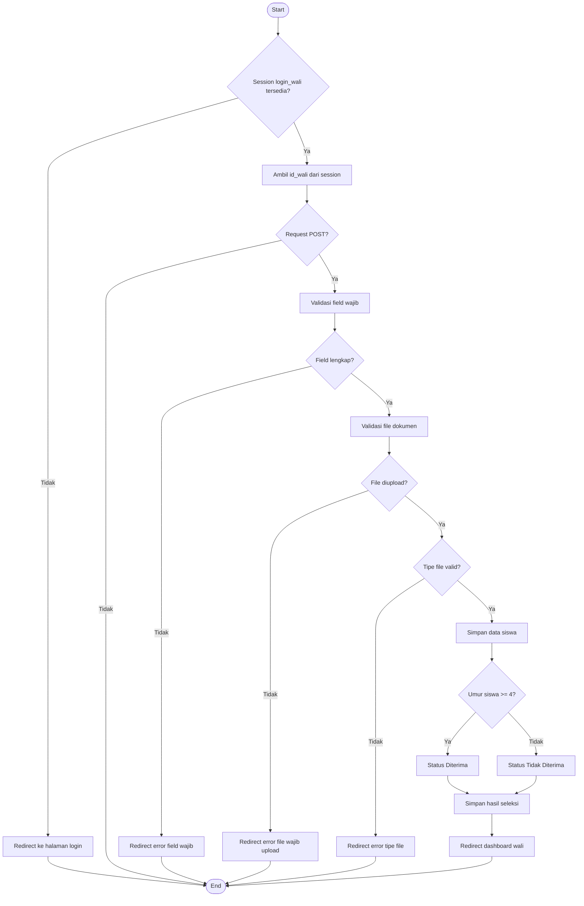
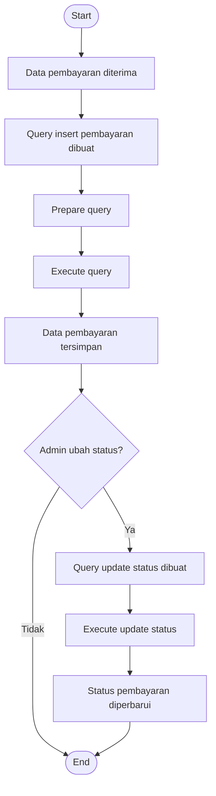

# Model Control Flow Testing

## 1. Pengertian Model Control Flow Testing

**Model Control Flow Testing** adalah salah satu model **White Box Testing** yang berfokus pada pemeriksaan alur kontrol atau **control flow** pada program. Pengujian ini dilakukan untuk memastikan bahwa setiap jalur eksekusi program berjalan sesuai dengan logika yang telah dibuat dan tidak terjebak dalam alur yang salah.

Pada Sistem **PPDB TKQ AS-SALAM**, Model Control Flow Testing digunakan untuk memeriksa alur program pada fitur **pendaftaran siswa** dan **pembayaran**. Pengujian dilakukan dengan melihat percabangan kondisi, proses validasi, dan hasil yang ditampilkan oleh sistem.

---

## 2. Tujuan Pengujian

| No | Tujuan Pengujian                                                                             |
| -- | -------------------------------------------------------------------------------------------- |
| 1  | Memastikan alur login wali siswa berjalan dengan benar                                       |
| 2  | Memastikan alur validasi form pendaftaran berjalan sesuai kondisi                            |
| 3  | Memastikan alur validasi dokumen upload berjalan sesuai aturan                               |
| 4  | Memastikan alur seleksi otomatis berdasarkan umur siswa berjalan benar                       |
| 5  | Memastikan alur penyimpanan dan perubahan status pembayaran berjalan sesuai kebutuhan sistem |

---

## 3. Modul yang Diuji

| No | Modul                 | File Program                  | Keterangan                                                                     |
| -- | --------------------- | ----------------------------- | ------------------------------------------------------------------------------ |
| 1  | **Pendaftaran Siswa** | `controllers/pendaftaran.php` | Mengelola alur login wali, validasi form, upload dokumen, dan seleksi otomatis |
| 2  | **Pembayaran**        | `models/Pembayaran.php`       | Mengelola alur penyimpanan pembayaran dan update status pembayaran             |

---

## 4. Source Code yang Diuji

### 4.1 Source Code Modul Pendaftaran

```php
if (!isset($_SESSION['login_wali'])) {
    header('Location: ../views/login.php');
    exit();
}

$id_wali = $_SESSION['id_wali'];

if ($_SERVER['REQUEST_METHOD'] === 'POST') {

    $requiredFields = [
        'nama_siswa',
        'nik_siswa',
        'jenis_kelamin_siswa',
        'umur_siswa',
        'alamat_siswa'
    ];

    foreach ($requiredFields as $field) {
        if (empty(trim($_POST[$field] ?? ''))) {
            header("Location: ../views/register.php?error=Field $field wajib diisi");
            exit();
        }
    }

    $requiredFiles = ['akta_kelahiran', 'kk', 'foto_siswa'];
    $allowedTypes = ['image/jpeg', 'image/png', 'application/pdf'];

    foreach ($requiredFiles as $fileKey) {
        if (!isset($_FILES[$fileKey]) || $_FILES[$fileKey]['error'] !== UPLOAD_ERR_OK) {
            header("Location: ../views/register.php?error=File $fileKey wajib diupload.");
            exit();
        }

        if (!in_array($_FILES[$fileKey]['type'], $allowedTypes)) {
            header("Location: ../views/register.php?error=File $fileKey harus bertipe JPG, PNG, atau PDF.");
            exit();
        }
    }

    $id_siswa = $siswaModel->register($data_siswa);

    $status = ($_POST['umur_siswa'] >= 4) ? 'Diterima' : 'Tidak Diterima';

    $hasilSeleksiModel->insert([
        'id_siswa' => $id_siswa,
        'id_wali' => $id_wali,
        'status_pendaftaran' => $status
    ]);

    header('Location: ../views/dashboard_wali.php?register_success=1');
    exit();
}
```

### 4.2 Source Code Modul Pembayaran

```php
public function insert($data)
{
    $sql = "INSERT INTO pembayaran 
    (id_biaya, id_wali, tanggal_pembayaran, nominal_dibayar, status_pembayaran, metode_pembayaran, keterangan_pembayaran)
    VALUES 
    (:id_biaya, :id_wali, :tanggal_pembayaran, :nominal_dibayar, :status_pembayaran, :metode_pembayaran, :keterangan_pembayaran)";

    $stmt = $this->pdo->prepare($sql);

    $stmt->execute([
        ':id_biaya' => $data['id_biaya'],
        ':id_wali' => $data['id_wali'],
        ':tanggal_pembayaran' => $data['tanggal_pembayaran'],
        ':nominal_dibayar' => $data['nominal_dibayar'],
        ':status_pembayaran' => $data['status_pembayaran'],
        ':metode_pembayaran' => $data['metode_pembayaran'],
        ':keterangan_pembayaran' => $data['keterangan_pembayaran']
    ]);
}

public function updateStatus($id_pembayaran, $status)
{
    $sql = "UPDATE pembayaran 
            SET status_pembayaran = :status_pembayaran 
            WHERE id_pembayaran = :id_pembayaran";

    $stmt = $this->pdo->prepare($sql);

    $stmt->execute([
        ':status_pembayaran' => $status,
        ':id_pembayaran' => $id_pembayaran
    ]);
}
```

---

## 5. Alur Control Flow Modul Pendaftaran

| No | Alur Program          | Kondisi                             | Hasil yang Diharapkan                             |
| -- | --------------------- | ----------------------------------- | ------------------------------------------------- |
| 1  | Start                 | Sistem membuka proses pendaftaran   | Proses dimulai                                    |
| 2  | Cek session wali      | Jika `login_wali` tidak tersedia    | Redirect ke halaman login                         |
| 3  | Cek session wali      | Jika `login_wali` tersedia          | Sistem mengambil `id_wali`                        |
| 4  | Cek request           | Jika request bukan POST             | Sistem tidak memproses pendaftaran                |
| 5  | Cek request           | Jika request POST                   | Sistem lanjut validasi field                      |
| 6  | Validasi field wajib  | Jika field kosong                   | Redirect dengan pesan error                       |
| 7  | Validasi field wajib  | Jika field lengkap                  | Sistem lanjut validasi file                       |
| 8  | Validasi file dokumen | Jika file tidak diupload            | Redirect dengan pesan error file wajib diupload   |
| 9  | Validasi tipe file    | Jika file bukan JPG, PNG, atau PDF  | Redirect dengan pesan error tipe file tidak valid |
| 10 | Validasi file selesai | Jika file valid                     | Sistem lanjut menyimpan data siswa                |
| 11 | Simpan data siswa     | Data siswa valid                    | Data siswa disimpan ke database                   |
| 12 | Seleksi umur          | Jika umur siswa 4 tahun atau lebih  | Status menjadi `Diterima`                         |
| 13 | Seleksi umur          | Jika umur siswa kurang dari 4 tahun | Status menjadi `Tidak Diterima`                   |
| 14 | Simpan hasil seleksi  | Status sudah ditentukan             | Data hasil seleksi disimpan                       |
| 15 | Redirect dashboard    | Proses selesai                      | Wali diarahkan ke dashboard                       |

---

## 6. Alur Control Flow Modul Pembayaran

| No | Alur Program            | Kondisi                          | Hasil yang Diharapkan                       |
| -- | ----------------------- | -------------------------------- | ------------------------------------------- |
| 1  | Start                   | Proses pembayaran dimulai        | Sistem menerima data pembayaran             |
| 2  | Fungsi `insert($data)`  | Data pembayaran tersedia         | Sistem membuat query insert                 |
| 3  | Query pembayaran        | Query berhasil disiapkan         | Sistem menjalankan query dengan `execute()` |
| 4  | Penyimpanan pembayaran  | Data valid                       | Data pembayaran tersimpan ke database       |
| 5  | Fungsi `updateStatus()` | Admin mengubah status pembayaran | Sistem membuat query update                 |
| 6  | Query update status     | `id_pembayaran` tersedia         | Sistem memperbarui status pembayaran        |
| 7  | End                     | Proses selesai                   | Status pembayaran berhasil berubah          |

---

## 7. Flow Graph Modul Pendaftaran



---

## 8. Flow Graph Modul Pembayaran



---

## 9. Skenario Pengujian Modul Pendaftaran

| No | Kondisi                                       | Hasil yang Diharapkan                          | Hasil Pengujian               | Status |
| -- | --------------------------------------------- | ---------------------------------------------- | ----------------------------- | ------ |
| 1  | Wali siswa belum login                        | Redirect ke halaman login                      | Redirect ke halaman login     | Passed |
| 2  | Wali siswa sudah login                        | Sistem mengambil `id_wali`                     | `id_wali` berhasil digunakan  | Passed |
| 3  | Request bukan POST                            | Sistem tidak memproses pendaftaran             | Proses tidak dijalankan       | Passed |
| 4  | Field wajib kosong                            | Sistem menampilkan pesan error                 | Pesan error muncul            | Passed |
| 5  | Field wajib lengkap                           | Sistem lanjut ke validasi file                 | Proses validasi file berjalan | Passed |
| 6  | File dokumen tidak diupload                   | Sistem menampilkan pesan file wajib diupload   | Pesan error muncul            | Passed |
| 7  | Tipe file tidak sesuai                        | Sistem menampilkan pesan tipe file tidak valid | Pesan error muncul            | Passed |
| 8  | Data valid dan umur siswa 4 tahun atau lebih  | Status pendaftaran menjadi `Diterima`          | Status `Diterima`             | Passed |
| 9  | Data valid dan umur siswa kurang dari 4 tahun | Status pendaftaran menjadi `Tidak Diterima`    | Status `Tidak Diterima`       | Passed |
| 10 | Proses berhasil                               | Sistem redirect ke dashboard wali              | Redirect ke dashboard wali    | Passed |

---

## 10. Skenario Pengujian Modul Pembayaran

| No | Kondisi                             | Hasil yang Diharapkan                            | Hasil Pengujian            | Status |
| -- | ----------------------------------- | ------------------------------------------------ | -------------------------- | ------ |
| 1  | Data pembayaran lengkap             | Data pembayaran disimpan ke database             | Data berhasil tersimpan    | Passed |
| 2  | Query insert dijalankan             | Sistem menjalankan `execute()`                   | Query berhasil dijalankan  | Passed |
| 3  | Admin memperbarui status pembayaran | Status pembayaran berubah                        | Status berhasil diperbarui | Passed |
| 4  | `id_pembayaran` tersedia            | Sistem mengubah status berdasarkan ID pembayaran | Status berubah sesuai ID   | Passed |
| 5  | Proses pembayaran selesai           | Sistem menampilkan status pembayaran terbaru     | Status pembayaran tampil   | Passed |

---

## 11. Komunikasi Programmer dan SQ Tester

| No | Komunikasi     | Isi Komunikasi                                                                                     |
| -- | -------------- | -------------------------------------------------------------------------------------------------- |
| 1  | **SQ Tester**  | Apakah sistem memiliki alur untuk pengguna yang belum login?                                       |
|    | **Programmer** | Ya, jika session `login_wali` tidak tersedia, sistem akan redirect ke halaman login.               |
| 2  | **SQ Tester**  | Apakah proses pendaftaran hanya berjalan saat request POST?                                        |
|    | **Programmer** | Ya, proses pendaftaran hanya dijalankan ketika form dikirim menggunakan request POST.              |
| 3  | **SQ Tester**  | Apakah sistem memiliki alur untuk field kosong?                                                    |
|    | **Programmer** | Ya, jika ada field wajib yang kosong, sistem akan menghentikan proses dan menampilkan pesan error. |
| 4  | **SQ Tester**  | Apakah sistem memiliki alur untuk file dokumen yang tidak valid?                                   |
|    | **Programmer** | Ya, sistem memeriksa file upload dan tipe file. Jika tidak sesuai, sistem menampilkan pesan error. |
| 5  | **SQ Tester**  | Bagaimana alur ketika umur siswa memenuhi syarat?                                                  |
|    | **Programmer** | Sistem akan menetapkan status pendaftaran menjadi `Diterima`.                                      |
| 6  | **SQ Tester**  | Bagaimana alur ketika umur siswa belum memenuhi syarat?                                            |
|    | **Programmer** | Sistem akan menetapkan status pendaftaran menjadi `Tidak Diterima`.                                |
| 7  | **SQ Tester**  | Apakah pembayaran memiliki alur perubahan status?                                                  |
|    | **Programmer** | Ya, status pembayaran dapat diperbarui melalui fungsi `updateStatus()`.                            |

---

## 12. Hasil Pengujian

Berdasarkan hasil **Model Control Flow Testing**, alur kontrol pada fitur **pendaftaran siswa** dan **pembayaran** sudah berjalan sesuai dengan logika program. Pada fitur pendaftaran, sistem memiliki alur untuk menangani kondisi pengguna belum login, request bukan POST, field kosong, file tidak diupload, tipe file tidak sesuai, data valid, umur memenuhi syarat, dan umur tidak memenuhi syarat.

Pada fitur pembayaran, sistem memiliki alur untuk menyimpan data pembayaran dan memperbarui status pembayaran. Setiap kondisi utama sudah memiliki jalur eksekusi yang jelas.

---

## 13. Kesimpulan

Berdasarkan pengujian menggunakan **Model Control Flow Testing**, dapat disimpulkan bahwa alur kontrol pada Sistem PPDB TKQ AS-SALAM sudah berjalan dengan baik. Sistem mampu mengarahkan pengguna sesuai kondisi yang terjadi, baik pada proses pendaftaran maupun pembayaran.

Dengan demikian, fitur **pendaftaran siswa** dan **pembayaran** dinyatakan layak berdasarkan pengujian Model Control Flow Testing.

---

## 14. Rekomendasi

| No | Rekomendasi                                                                           |
| -- | ------------------------------------------------------------------------------------- |
| 1  | Menambahkan validasi ukuran file upload agar dokumen lebih aman                       |
| 2  | Menambahkan validasi nominal pembayaran agar tidak menerima nilai kosong atau negatif |
| 3  | Menambahkan pesan error yang lebih jelas pada setiap kondisi kegagalan                |
| 4  | Melakukan pengujian ulang setiap ada perubahan alur program                           |
| 5  | Mendokumentasikan hasil Control Flow Testing di GitHub secara berkala                 |

---
